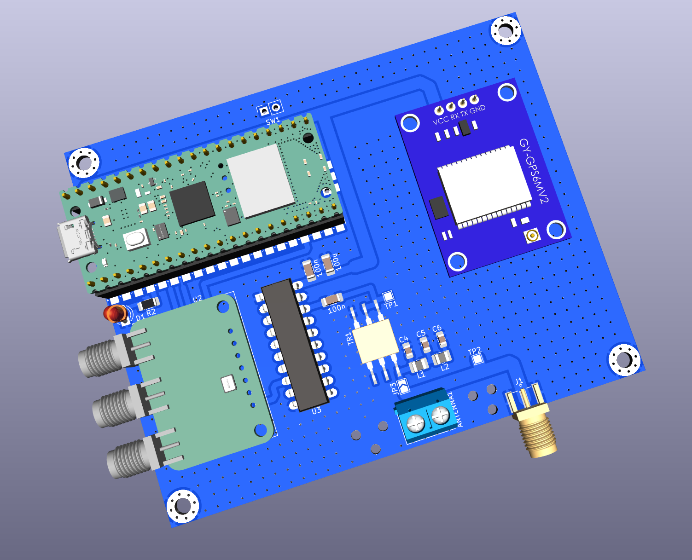

### Easy Beacons

A simple and easy Raspberry Pi Pico W powered WSPR, and FT8 beacon system which
uses a NEO-6M (or better) GPS module for timing.

The whole design is modular, parametric (cost and others), and super
extensible. It is almost trivial to add support for more `beacon modes`.

Cost to build: Less than 2300 INR (< 28 USD).

Note: Use this project with https://github.com/kholia/Si5351-Module-Clone-TCXO/.

Cost breakdown: PCB (175) + Si5351 module (479) + Pico W (649) + Octal Driver
chip (85) + Passives (50) + Connectors (25) + Toroids (40) + GPS module (300) +
Wire (30) + Wire Ferrules (10) + Misc (50) + 425 (TR1).

Power output: 250mW even @ 28 MHz with a 5v supply (via USB).



[UPDATE] This PCB was validated in late 2023 - everything works great!

#### Build Steps

Use a stable version of the Arduino IDE 1.8.19 or later to build the project.

If you are on Linux, execute the following steps:

```
sudo apt-get install git  # install 'git' if needed

git clone https://github.com/kholia/Easy-Beacons-STEM.git

make install_arduino_cli
make install_platform
make deps
```

If you are using Windows OS, execute the following steps:

- Download this repository.

- Extract the downloaded zip file to a folder.

- Run the `setup_arduino_ide.bat` file inside this folder.

Note: Change the following lines in the code to use your own values:

```
char call[] = "VU3CER";
char loc[] = "MK68";
uint8_t dbm = 23;
```

#### Amplified-WSPR-Beacon-v3

- Supply 5v to Raspberry Pico W using a mobile (phone) charger or a USB 5v
  battery bank.

#### Usage

TIP: Please use a local (or nearby) receiver to receive and decode the beacon
signals! This is important to ensure that your beacon is calibrated and TX'ing
correctly.


#### Safety Notes

- Connect a series 100nF at Si5351 CLK outputs.

- Do NOT connect a LED to the output(s) of Si5351 directly for educational
  purposes. Use a 330 or 470 ohm resistor in series or use a transistor driver
  at the Si5351 outputs (much better).

#### BOM (partial)

- SN74ACT244N (Fast DIP-20 Octal Driver)

- T2-613-1 IC (1:1:2 transformer IC from Mini-Circuits)

- Si5351A Module (with TCXO preferably)


#### Install the firmware on Pi Pico

- Hold down the BOOTSEL button on your Pico (keep holding it down) and plug it
  into your computer's USB port.

  Now release the BOOTSEL button.

- Open Explorer, and open the RPI-RP2 directory like you would any other hard
  drive.

- Drag and drop the UF2 file (`firmware.uf2`) from this folder into the RPI-RP2
  directory.

- Done ;)


#### Build from source

Use the latest Arduino IDE along with https://github.com/earlephilhower/arduino-pico
to build this source code.


#### Next Steps

Check out the "DDX - Direct Digital Transceiver" design for added fun!


#### Tips

- https://en.wikipedia.org/wiki/Electric_wire_ferrule - Use wire ferrules for the antenna wires
