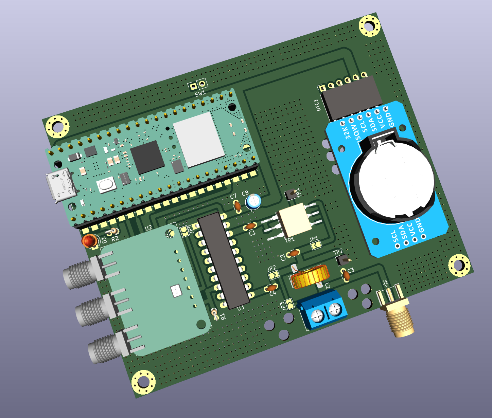

### Easy Beacons

A simple and easy Raspberry Pi Pico W powered WSPR, and FT8 beacon system which
uses RTC (DS3231) for timing.

The whole design is modular, parametric (cost and others), field repairable,
and super extensible. It is almost trivial to add support for more `beacon
modes`.

Cost to build: Less than 2300 INR (< 28 USD).

Cost breakdown: PCB (175) + Si5351 module (479) + Pico W (649) + Octal Driver
chip (85) + Passives (50) + Connectors (25) + Toroids (40) + RTC module (275) +
Wire (30) + Wire Ferrules (10) + Misc (50) + 425 (TR1).

Power output: 250mW even @ 28 MHz with a 5v supply (via USB).

Note: The kit needs to be (soldering) friendly enough - it will be built by
senior folks as well as young kids.



[UPDATE] This PCB was validated on 24-Feb-2023 - everything works great!


#### Build Steps

Use a stable version of the Arduino IDE 1.8.19 or later to build the project.

If you are on Linux, execute the following steps:

```
sudo apt-get install git  # install 'git' if needed

git clone https://github.com/kholia/Easy-Beacons-STEM.git

make install_arduino_cli
make install_platform
make deps
```

If you are using Windows OS, execute the following steps:

- Download this repository.

- Extract the downloaded zip file to a folder.

- Run the `setup_arduino_ide.bat` file inside this folder.

Note: Change the following lines in the code to use your own values:

```
char call[] = "VU3CER";
char loc[] = "MK68";
uint8_t dbm = 23;
```

#### Amplified-WSPR-Beacon-v3

- Supply 5v to Raspberry Pico W using a mobile (phone) charger or a USB 5v
  battery bank.

Note: The PCB version of the `Amplified-WSPR-Beacon-v3` sub-project uses the
code from the `firmware` folder.


#### Usage

TIP: Please use a local (or nearby) receiver to receive and decode the beacon
signals! This is important to ensure that your beacon is calibrated and TX'ing
correctly.


#### Safety Notes

- Connect a 1k or 2.2k resistor between Si5351 CLK outputs and GND.

- Connect a series 100nF at Si5351 CLK outputs.

- Do NOT connect a LED to the output(s) of Si5351 directly for educational
  purposes. Use a 330 or 470 ohm resistor in series or use a transistor driver
  at the Si5351 outputs (much better).


#### BOM

- 1 x 3/5mm LED (purple or pink is recommended)

- 1 x 0.25W 2.2k ohms CFR / MFR (resistor)

- Couple of 100nF 50V MLCC caps

- 100uF/16V electrolytic caps

- 220pF C0G MLCC caps

- 27 to 29 SWG copper winding ("magnetic") wire

  - PTFE (teflon) winding wire could be better

- PCB Terminal Block (5.08mm spacing, 2 holes)

- Raspberry Pi Pico W board

- DS3231 RTC module

- SN74ACT244N (Fast DIP-20 Octal Driver)

- T2-613-1 IC (1:1:2 transformer IC from Mini-Circuits)

- Si5351A Module (with TCXO preferably)


#### Install the firmware on Pi Pico

- Hold down the BOOTSEL button on your Pico (keep holding it down) and plug it
  into your computer's USB port.

  Now release the BOOTSEL button.

- Open Explorer, and open the RPI-RP2 directory like you would any other hard
  drive.

- Drag and drop the UF2 file (`firmware.uf2`) from this folder into the RPI-RP2
  directory.

- Done ;)


#### Build from source

Use the latest Arduino IDE along with https://github.com/earlephilhower/arduino-pico
to build this source code.


#### Next Steps

Check out the "DDX - Direct Digital Transceiver" design for added fun!


#### Tips

- https://en.wikipedia.org/wiki/Electric_wire_ferrule - Use wire ferrules for the antenna wires
