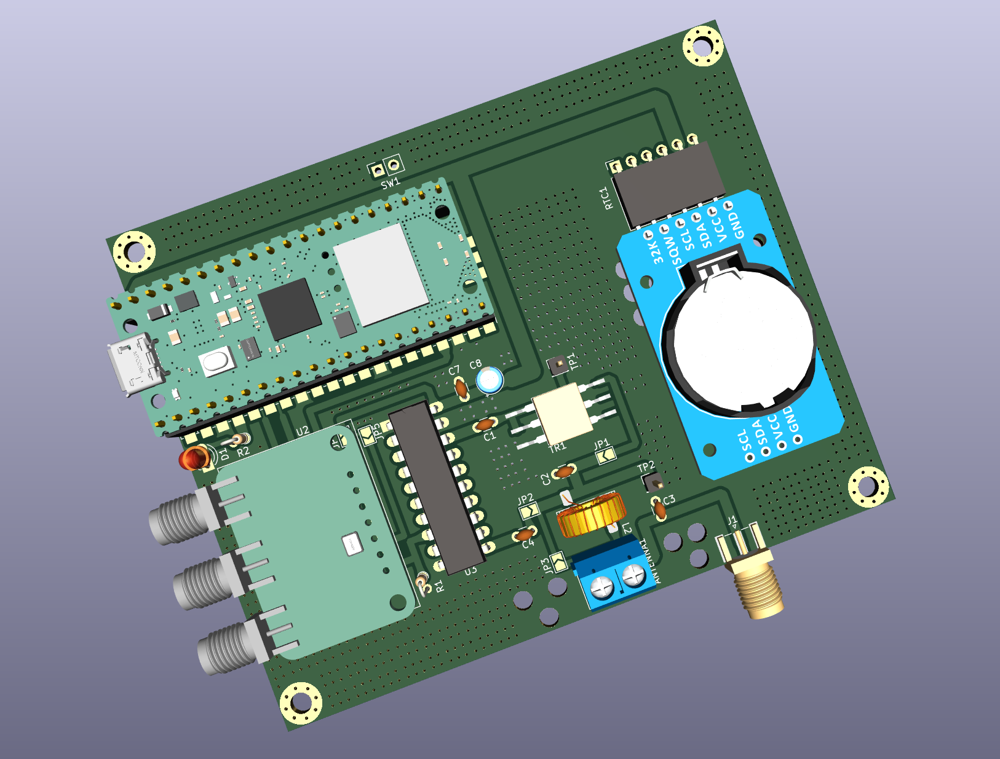

### Easy Beacons

A simple and easy Raspberry Pi Pico powered WSPR, and FT8 beacon system which
uses GPS for timing.

Note: The whole project can be assembled on a breadboard (including the [~100mW
amplifier](./QRPp-Amplifier-v2)) in under an hour - do give it a go!

The whole design is modular, parametric (cost and others), field repairable,
and super extensible. It is almost trivial to add support for more `beacon
modes`.

Note: This documentation is a WIP (work-in-progress), and can't be trusted
100%. Please switch on your brain, and read the actual code and schematics.
This repository has more than 10 sub-projects, and can get confusing to follow
unless you read the actual code, and schematics.


#### Build Steps

Use a stable version of the Arduino IDE 1.8.19 or later to build the project.

If you are on Linux, execute the following steps:

```
sudo apt-get install git  # install 'git' if needed

git clone https://github.com/kholia/Easy-Beacons-STEM.git

make install_arduino_cli
make install_platform
make deps
```

If you are using Windows OS, execute the following steps:

- Download this repository.

- Extract the downloaded zip file to a folder.

- Run the `setup_arduino_ide.bat` file inside this folder.

Note: Change the following lines in the code to use your values:

```
char message[] = "VU3CER VU3FOE MK68";
char call[] = "VU3FOE";
char loc[] = "MK68";
uint8_t dbm = 27;
```

#### Amplified-WSPR-Beacon-v3

- Power from a USB power bank @ 5v.



Note: The PCB version of the `Amplified-WSPR-Beacon-v3` sub-project uses the
`Pico-Beacons-GPS-v2` firmware (code).


#### Amplified-WSPR-Beacon

- Do NOT power with more than 8.4v!

- Use an 7.5v AC adapter for continuous use


Note: The PCB version of the `Amplified-WSPR-Beacon` sub-project uses the `Pico-Beacons-GPS-v2` firmware (code).

Note 2: The `Amplified-WSPR-Beacon-v2` project uses 5v from USB.


#### Usage

When `SW1` switch is OFF, the system acts as a WSPR beacon.

When `SW1` switch is ON, the system acts as a FT8 beacon.

TIP: Please use a local (or nearby) receiver to receive and decode the beacon
signals! This is important to ensure that your beacon is TX'ing correctly.

#### Schematic

Here is the schematic for the `Pico-Beacons` sketch:

Pin 16 (GP16) is SDA and Pin 17 (GP17) is SCL - connect Si5351 module to these
pins. Connect GPS's TX pin to pin 12 (GP9) of Pi Pico.


#### Performance

7W (or less) of HF RF power offers global communications coverage when
propagation is good:


WSPR mode demo:


#### Battery System Recommendation

I recommend using a LiFePo4 (LFP) battery which has good energy density and is
also priced decently well.


Use the LFP battery with a `1S LFP BMS`.


The BMS' output can be connected directly to the 3.3v input of the ESP8266
module.

https://www.waveshare.com/wiki/Solar_Power_Manager - this `Solar Power
Management Module, for 6V~24V Solar Panel` works pretty well.


#### Power Notes

This will need a HF RF PA in many cases to be usable on the air.

You can also start with the easy-to-build and breadboard-friendly [QRPp-Amplifier-v2](./QRPp-Amplifier-v2).


#### Safety Notes

- Connect a 1k or 2.2k resistor between Si5351 CLK outputs and GND.

- Connect a series 100nF at Si5351 CLK outputs.

- Do NOT connect a LED to the output(s) of Si5351 directly. Use a 330 or 470
  ohm resistor in series or use a transistor driver at the Si5351 outputs
  (better).


#### Compliance Notes

Please use a LPF at the output.


#### Gotchas

- https://github.com/mikalhart/TinyGPSPlus/issues/30 (NEO-6M modules can be buggy)


#### BOM

- 1 x 3/5mm LED (purple or pink is recommended)

- 1 x small regular (spst) chassis mount switch

- 1 x 0.25w 470 ohm resistor (CFR / MFR)

- High quality dupont cables / jumper cables

- Couple of 100nF 50V MLCC

- Zero PCB of a suitable size

- Raspberry Pi Pico board

- GPS module - NEO-7-M or better

- BS170 MOSFET (original only)

- SN74ACT00N (DIP 14 NAND Logic IC)

- Si5351A Module

  


#### Install the firmware on Pi Pico

- Hold down the BOOTSEL button on your Pico (keep holding it down) and plug it
  into your computer's USB port.

  Now release the BOOTSEL button.

- Open Explorer, and open the RPI-RP2 directory like you would any other hard
  drive.

- Drag and drop the UF2 file (`firmware.uf2`) from this folder into the RPI-RP2
  directory.

- Done ;)


#### Build from source

Use the latest Arduino IDE along with https://github.com/earlephilhower/arduino-pico
to build this source code.


#### Next Steps

Check out the ADX and PDX radio designs for added fun!
